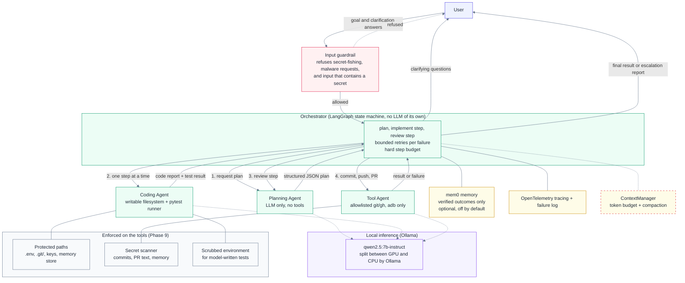

# Claude Multiagent

A local-first, multi-agent AI coding assistant: a Planner, a Coder, and a Tool agent cooperate
under a strict orchestrator loop, aiming to turn a plain-language coding/debugging request into a
tested, reviewed pull request — running entirely on local hardware, no paid APIs. It is judged
by a fixed golden task set with hidden acceptance tests
([REQUIREMENTS.md §11](REQUIREMENTS.md#11-evaluation-phase-10)), not by the model's own claims.

- Technical requirements & design decisions: [REQUIREMENTS.md](REQUIREMENTS.md)
- Plain-English explanation: [NON_TECHNICAL.md](NON_TECHNICAL.md)
- Phase-by-phase plan & status: [TRACKER.md](TRACKER.md)
- Build/process rules: [CLAUDE.md](CLAUDE.md)
- What went wrong with the first (1.5B) local model: [failed_experiment.md](failed_experiment.md)

## Architecture



Solid boxes are wired into the running system. **The red dashed box is built and unit-tested but
not yet connected to it** — context budgeting exists as a module, but nothing calls it (verified by
searching the code; see
[REQUIREMENTS.md §12](REQUIREMENTS.md#12-wiring-audit-what-is-built-versus-what-runs)). Memory is
wired as an optional injection but no entrypoint or evaluation run enables it. Tracing is wired
into the stack the evaluation builds (`build_real_system`): every LLM, agent and git call is a span
under one root span per run, written as JSON lines to `logs/traces.jsonl`, with failures in
`logs/failures.jsonl`. There is still no other entrypoint to attach it to.

**Design principles:** least-privilege tool access per agent, structured JSON contracts between
agents (never free text), tool output is always treated as data (never as instructions), bounded
retries with no infinite loops, and every agent/tool call logged and traced for evaluation. Full
rationale in [REQUIREMENTS.md](REQUIREMENTS.md).

## Hardware this runs on

AMD Ryzen 7 4800H (8c/16t), 16GB RAM, NVIDIA GTX 1650 Ti (4GB VRAM). The agents run on
`qwen2.5:7b-instruct` (7.6B parameters, 4.7GB), which does not fit the GPU entirely, so Ollama
splits it between GPU and CPU (measured about 8 tokens/s here). See
[REQUIREMENTS.md §3](REQUIREMENTS.md#3-hardware--local-inference-design) and
[TRACKER.md — Decisions log](TRACKER.md#1-decisions-log).

## Tools & libraries

| Area | Choice |
|---|---|
| Agent orchestration | [LangGraph](https://github.com/langchain-ai/langgraph) |
| Local LLM serving (all agents) | [Ollama](https://ollama.com/) (`qwen2.5:7b-instruct`, split between GPU and CPU) |
| Optional alternative backend | [llama.cpp](https://github.com/ggml-org/llama.cpp) (`llama-server`) |
| Observability | [OpenTelemetry](https://opentelemetry.io/) |
| Evaluation | In-repo harness: golden tasks with hidden acceptance tests, Wilson intervals (LangSmith/OpenEval are **not** used; LangSmith is only present as a LangGraph dependency and disabled) |
| Memory | [mem0](https://github.com/mem0ai/mem0) (local backend) |
| Validation / contracts | [pydantic](https://docs.pydantic.dev/) |
| Config | [pydantic-settings](https://docs.pydantic.dev/latest/concepts/pydantic_settings/) |
| Testing | [pytest](https://docs.pytest.org/) |
| Packaging | [uv](https://github.com/astral-sh/uv) |
| Git/GitHub | git, [gh CLI](https://cli.github.com/) |

## Status

Development follows the phase plan in [TRACKER.md](TRACKER.md). This section grows with a short
note per phase as it lands.

- **Phase 0 — Project scaffolding**: governance docs, config skeleton, and this repo created.
- **Phase 1 — Local model serving**: a `llama-server` launcher and an Ollama client, both behind
  a shared `LLMClient` interface. Ollama is the backend the system now runs on; `llama-server`
  remains as an optional backend. See
  [REQUIREMENTS.md §3](REQUIREMENTS.md#3-hardware--local-inference-design).
- **Phase 2 — Shared infra**: the strict `AgentMessage` JSON contract sub-agents communicate
  through, OpenTelemetry tracing + a structured failure log for every agent/tool call, and a
  guardrail filter blocking secret-fishing requests while treating all tool output as inert data.
- **Phase 3 — Context engineering**: every agent's conversation history is tracked against a
  token budget derived from the configured context size and compacted before it would
  overflow — stale tool output evicted first, then older turns summarized. See
  [REQUIREMENTS.md §6](REQUIREMENTS.md#6-context-engineering-treat-context-as-a-budget).
- **Phase 4 — Planning agent**: a sandboxed read-only filesystem tool, a prompt template, a
  response parser (handles reasoning blocks and malformed/truncated JSON), and `PlannerAgent`,
  composing them into "produce a plan or ask for clarification".
- **Phase 5 — Coding agent**: a sandboxed writable filesystem tool and a sandboxed pytest runner
  (both with no shell strings, both with a hard timeout/all-or-nothing path validation), plus
  `CoderAgent.implement_step()` — propose a test-first change, write it, run the real suite, and
  report. TDD is enforced at the schema level (a proposal with no test files fails validation), a
  failing test run is reported as useful data rather than a system error, and files are never
  rolled back on failure.
- **Phase 6 — Tool agent**: deterministic, allowlisted `git`/`gh` wrappers (no shell strings, no
  generic passthrough), a generic bounded-retry + circuit-breaker module reused across the whole
  system, a best-effort hardware/emulator test runner that reports unavailability honestly, and
  `ToolAgent` composing all three — the only agent with git/GitHub access. Its one LLM-assisted
  step (commit-message generation) is deliberately scoped to short natural-language output.
- **Phase 7 — Orchestrator**: the LangGraph state machine wiring Planner → Coder →
  Planner-review → Tool into one loop, behind `Orchestrator.run()`/`.resume()`. Bounded retries
  on every failure path (planner, coder, tests/review, tool), a hard step-budget circuit
  breaker, and a human-in-the-loop clarification interrupt. A live end-to-end run caught a real
  gap in the retry policy (fixed). All three sub-agents are wired into one working system.
- **Phase 8 — Memory layer**: local mem0 (Ollama `nomic-embed-text` embeddings + on-disk vector
  store, no LLM, telemetry off) behind a project-scoped `MemoryStore`, wired into the
  orchestrator: agents get relevant recalled context, and only *verified* outcomes (approved
  steps, clarification answers, completed tasks) are remembered. Recall ~0.02s, +4 MiB GPU. See
  [REQUIREMENTS.md §9](REQUIREMENTS.md#9-memory-layer-phase-8).
- **Phase 9 — Security hardening**: an audit of what was actually true, then fixes verified against
  the real system — protected paths (the Planner could read `.env`), outbound secret scanning,
  `git add` hardening, the input guardrail actually wired in (it was called nowhere) and rebuilt
  against a measured corpus, and a scrubbed environment for model-written tests. The honest
  headline is in [REQUIREMENTS.md §10.1](REQUIREMENTS.md#101-threat-model-what-is-mitigated-and-what-is-not):
  the Coder still executes model-written code with the developer's full OS privileges.
- **Phase 10 — Evaluation**: ten golden tasks with hidden acceptance tests, Wilson-interval
  metrics, and a runner that drives the real stack (real agents, real pytest, real git against a
  local bare remote) and keeps the evidence of every run that does not succeed. See
  [REQUIREMENTS.md §11](REQUIREMENTS.md#11-evaluation-phase-10). The first local model (1.5B
  parameters) did not pass it: [failed_experiment.md](failed_experiment.md).

## Running locally

1. Install [uv](https://github.com/astral-sh/uv), then from the repo root:
   ```
   uv sync
   cp .env.example .env   # adjust paths if your llama.cpp/model live elsewhere
   ```
2. Run the test suite: `uv run pytest`
3. Manually verify local model serving on your own hardware:
   `uv run python scripts/benchmark_llm.py`
4. Pull the model (the agents' default, `OLLAMA_AGENT_MODEL`) and run the golden-set evaluation
   (heavy: keeps the CPU and GPU busy for a long time, so not while you need the laptop):
   ```
   ollama pull qwen2.5:7b-instruct
   uv run python scripts/run_eval.py
   ```

Further setup instructions land here as later phases add runnable pieces.

## Evaluation: what we learned

We evaluate this system the way we'd evaluate a hire's work, not by reading its code: a small
golden set of ten tasks (simple features, bug fixes, a deliberately ambiguous task, and
adversarial requests) with hidden acceptance tests, run against the real stack end to end — real
agents, real pytest, real git — never mocked. The first local model we tried, 1.5B parameters on
`llama-server`, failed it completely: 0 of 16 implementation runs succeeded. The causes were read
from the raw evidence of every failed run, not guessed: it often couldn't produce valid JSON for
the inter-agent contract at all, guessed at ambiguous requirements instead of asking, and when
constrained to force valid JSON syntax, the *content* behind that now-valid JSON degraded into
nonsense file paths and empty files. The full record, including a plain-English explanation of
each failure, is in [failed_experiment.md](failed_experiment.md).

Moving to Ollama `qwen2.5:7b-instruct` (still fully local, no paid APIs) didn't fix things by
itself — the same golden set scored 0 of 16 on the bigger model too, for different,
orchestration-level reasons: a review gate that rejected correct code about as often as buggy
code (it couldn't see the actual code or test output, only a boolean); retries that never told
the Coding agent *why* its last attempt failed; full pytest cycles spent rediscovering a syntax
error a parser could catch instantly; and a Planning agent that defaulted to multi-step plans for
one-function tasks, burning a fixed retry budget before a fix could land. Each fix was measured
against the real model before being written and again after being shipped, not assumed to work:
review gate → retry feedback → a syntax pre-check → a plan-granularity rule → JSON-schema-
constrained decoding (verified this time not to repeat the 1.5B model's content-quality
trade-off). Together they took the system from 0 of 16 to a best-observed 11 of 16 (69%) — though
run-to-run variance is real and substantial on a sample this small and non-deterministic: repeated
runs on the *identical* configuration have scored anywhere from 4 to 11 of 16, almost entirely
driven by how often the Coding agent's own self-written tests happen to be internally consistent
on a given sampling run, which is now the largest single remaining source of failure. We also
found, and partially fixed, a Planning agent that never once asked a clarifying question on the
one deliberately ambiguous golden task across every run measured — a real but partial fix landed
(0% to 33% ask rate on ambiguous goals measured in isolation, no false positives), but it's
wording-sensitive enough that it hasn't yet moved that specific task's own outcome.

The Coding agent's own test-writing reliability turned out to be the dominant remaining failure
mode, so it was investigated directly rather than guessed at: a systematic survey of 95 real
failed attempts across five runs split it into two distinct sub-causes, not one. **A forgotten
`import`** (35% — a name used but never bound, in a test file or the implementation itself) is
mechanically detectable, and is now caught by a static check (the same pattern as the syntax
pre-check, using `pyflakes`) before a doomed pytest cycle runs. Confirmed working on the very next
golden run: it caught two real forgotten imports live, precisely and instantly. That run still
escalated anyway, though, which is itself informative — catching the mistake faster didn't help
once the same fixed retry budget then had to absorb the real logic bug the import mistake had been
masking. **The Coding agent inventing its own extra, stricter edge cases** beyond what was
actually asked, then failing to satisfy them (~29%), is next — a genuine reasoning limit, not a
mechanical one, so it will likely need scoping the Coding agent's own tests to what the plan step
asked for rather than another static check. A dedicated code model (e.g. `qwen2.5-coder`) instead
of a general-instruct one is untested here and could plausibly help both sub-causes. Closing the
JSON-constrained decoding path's residual ~3% failure rate and generalizing the clarifying-question
criteria beyond the specific wordings tested so far are smaller, lower-risk next steps. Every
golden run's raw results are kept in `evals/results/`, and the full quantitative history —
including the changes that made things *worse* and were rejected, not just the ones that worked —
is in [failed_experiment.md](failed_experiment.md).
