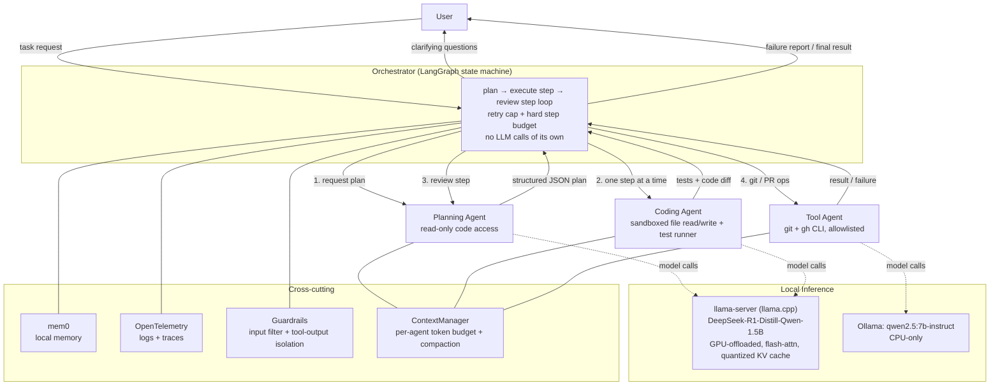

# Claude Multiagent

A local-first, multi-agent AI coding assistant: a Planner, a Coder, and a Tool agent cooperate
under a strict orchestrator loop to turn a plain-language coding/debugging request into a
tested, reviewed, merged pull request — running entirely on local hardware, no paid APIs.

- Technical requirements & design decisions: [REQUIREMENTS.md](REQUIREMENTS.md)
- Plain-English explanation: [NON_TECHNICAL.md](NON_TECHNICAL.md)
- Phase-by-phase plan & status: [TRACKER.md](TRACKER.md)
- Build/process rules: [CLAUDE.md](CLAUDE.md)

## Architecture



**Design principles:** least-privilege tool access per agent, structured JSON contracts between
agents (never free text), tool output is always treated as data (never as instructions), bounded
retries with no infinite loops, and every agent/tool call logged and traced for evaluation. Full
rationale in [REQUIREMENTS.md](REQUIREMENTS.md).

## Hardware this runs on

AMD Ryzen 7 4800H (8c/16t), 16GB RAM, NVIDIA GTX 1650 Ti (4GB VRAM). The local model allocation
is chosen specifically for this ceiling — see
[TRACKER.md — Decisions log](TRACKER.md#1-decisions-log).

## Tools & libraries

| Area | Choice |
|---|---|
| Agent orchestration | [LangGraph](https://github.com/langchain-ai/langgraph) |
| Local LLM serving (Planner/Coder) | [llama.cpp](https://github.com/ggml-org/llama.cpp) (`llama-server`) |
| Local LLM serving (Tool agent) | [Ollama](https://ollama.com/) (`qwen2.5:7b-instruct`, CPU-only) |
| Observability | [OpenTelemetry](https://opentelemetry.io/) |
| Evaluation (optional) | LangSmith / OpenEval (free tier, off by default) |
| Memory | [mem0](https://github.com/mem0ai/mem0) (local backend) |
| Validation / contracts | [pydantic](https://docs.pydantic.dev/) |
| Config | [pydantic-settings](https://docs.pydantic.dev/latest/concepts/pydantic_settings/) |
| Testing | [pytest](https://docs.pytest.org/) |
| Packaging | [uv](https://github.com/astral-sh/uv) |
| Git/GitHub | git, [gh CLI](https://cli.github.com/) |

## Status

Development follows the phase plan in [TRACKER.md](TRACKER.md). This section grows with a short
note per phase as it lands.

- **Phase 0 — Project scaffolding**: governance docs, config skeleton, and this repo created.
- **Phase 1 — Local model serving**: tuned `llama-server` launcher (GPU offload, flash attention,
  quantized KV cache, continuous batching) and a CPU-only Ollama client for the Tool agent, both
  behind a shared `LLMClient` interface. Verified on this laptop's actual GPU — see
  [REQUIREMENTS.md](REQUIREMENTS.md#3-hardware--local-inference-design) for the measured numbers.
- **Phase 2 — Shared infra**: the strict `AgentMessage` JSON contract sub-agents communicate
  through, OpenTelemetry tracing + a structured failure log for every agent/tool call, and a
  guardrail filter blocking secret-fishing requests while treating all tool output as inert data.
- **Phase 3 — Context engineering**: every agent's conversation history is tracked against a
  token budget derived from measured hardware (llama-server's `-np 2` splits its context per
  slot, so Planner/Coder each get ~4096 tokens, not the full 8192) and compacted before it would
  overflow — stale tool output evicted first, then older turns summarized. See
  [REQUIREMENTS.md §6](REQUIREMENTS.md#6-context-engineering-treat-context-as-a-budget).
- **Phase 4 — Planning agent**: a sandboxed read-only filesystem tool, a prompt template, a
  response parser (handles this model's `<think>` reasoning block and malformed/truncated JSON),
  and `PlannerAgent`, composing them into "produce a plan or ask for clarification". Live-verified
  against the real local model, which surfaced a real, documented limitation — see
  [REQUIREMENTS.md §8](REQUIREMENTS.md#8-known-limitations-measured-not-assumed).
- **Phase 5 — Coding agent**: a sandboxed writable filesystem tool and a sandboxed pytest runner
  (both with no shell strings, both with a hard timeout/all-or-nothing path validation), plus
  `CoderAgent.implement_step()` — propose a test-first change, write it, run the real suite, and
  report. TDD is enforced at the schema level (a proposal with no test files fails validation), a
  failing test run is reported as useful data rather than a system error, and files are never
  rolled back on failure. Live-verified twice against the real model — see REQUIREMENTS.md §8.
- **Phase 6 — Tool agent**: deterministic, allowlisted `git`/`gh` wrappers (no shell strings, no
  generic passthrough), a generic bounded-retry + circuit-breaker module reused across the whole
  system, a best-effort hardware/emulator test runner that reports unavailability honestly, and
  `ToolAgent` composing all three — the only agent with git/GitHub access. Its one LLM-assisted
  step (commit-message generation) is deliberately scoped to short natural-language output, which
  live-verified reliably on the CPU-only Ollama model — see REQUIREMENTS.md §8.
- **Phase 7 — Orchestrator**: the LangGraph state machine wiring Planner → Coder →
  Planner-review → Tool into one loop, behind `Orchestrator.run()`/`.resume()`. Bounded retries
  on every failure path (planner, coder, tests/review, tool), a hard step-budget circuit
  breaker, and a human-in-the-loop clarification interrupt. Live end-to-end run (real Planner +
  Coder, fake Tool agent) caught a real gap in the retry policy and a real case of the model
  gaming the TDD schema check — both fixed/recorded honestly rather than hidden, see
  REQUIREMENTS.md §8. All three sub-agents are now wired into one working system.

## Running locally

1. Install [uv](https://github.com/astral-sh/uv), then from the repo root:
   ```
   uv sync
   cp .env.example .env   # adjust paths if your llama.cpp/model live elsewhere
   ```
2. Run the test suite: `uv run pytest`
3. Manually verify local model serving on your own hardware:
   `uv run python scripts/benchmark_llm.py`

Further setup instructions land here as later phases add runnable pieces.

## Evaluation

Golden-set metrics (latency, token usage, tool success rate, hallucination rate & recovery, cost
proxy) will be published here once Phase 9 lands.
