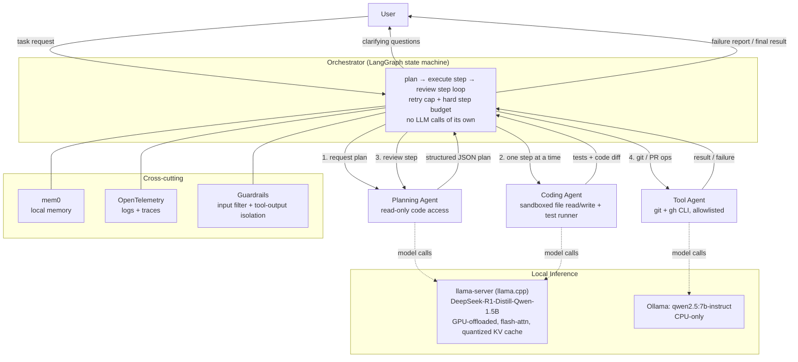

# Claude Multiagent

A local-first, multi-agent AI coding assistant: a Planner, a Coder, and a Tool agent cooperate
under a strict orchestrator loop to turn a plain-language coding/debugging request into a
tested, reviewed, merged pull request — running entirely on local hardware, no paid APIs.

- Technical requirements & design decisions: [REQUIREMENTS.md](REQUIREMENTS.md)
- Plain-English explanation: [NON_TECHNICAL.md](NON_TECHNICAL.md)
- Phase-by-phase plan & status: [TRACKER.md](TRACKER.md)
- Build/process rules: [CLAUDE.md](CLAUDE.md)

## Architecture



**Design principles:** least-privilege tool access per agent, structured JSON contracts between
agents (never free text), tool output is always treated as data (never as instructions), bounded
retries with no infinite loops, and every agent/tool call logged and traced for evaluation. Full
rationale in [REQUIREMENTS.md](REQUIREMENTS.md).

## Hardware this runs on

AMD Ryzen 7 4800H (8c/16t), 16GB RAM, NVIDIA GTX 1650 Ti (4GB VRAM). The local model allocation
is chosen specifically for this ceiling — see
[TRACKER.md — Decisions log](TRACKER.md#1-decisions-log).

## Tools & libraries

| Area | Choice |
|---|---|
| Agent orchestration | [LangGraph](https://github.com/langchain-ai/langgraph) |
| Local LLM serving (Planner/Coder) | [llama.cpp](https://github.com/ggml-org/llama.cpp) (`llama-server`) |
| Local LLM serving (Tool agent) | [Ollama](https://ollama.com/) (`qwen2.5:7b-instruct`, CPU-only) |
| Observability | [OpenTelemetry](https://opentelemetry.io/) |
| Evaluation (optional) | LangSmith / OpenEval (free tier, off by default) |
| Memory | [mem0](https://github.com/mem0ai/mem0) (local backend) |
| Validation / contracts | [pydantic](https://docs.pydantic.dev/) |
| Config | [pydantic-settings](https://docs.pydantic.dev/latest/concepts/pydantic_settings/) |
| Testing | [pytest](https://docs.pytest.org/) |
| Packaging | [uv](https://github.com/astral-sh/uv) |
| Git/GitHub | git, [gh CLI](https://cli.github.com/) |

## Status

Development follows the phase plan in [TRACKER.md](TRACKER.md). This section grows with a short
note per phase as it lands.

- **Phase 0 — Project scaffolding**: governance docs, config skeleton, and this repo created.
- **Phase 1 — Local model serving**: tuned `llama-server` launcher (GPU offload, flash attention,
  quantized KV cache, continuous batching) and a CPU-only Ollama client for the Tool agent, both
  behind a shared `LLMClient` interface. Verified on this laptop's actual GPU — see
  [REQUIREMENTS.md](REQUIREMENTS.md#3-hardware--local-inference-design) for the measured numbers.

## Running locally

1. Install [uv](https://github.com/astral-sh/uv), then from the repo root:
   ```
   uv sync
   cp .env.example .env   # adjust paths if your llama.cpp/model live elsewhere
   ```
2. Run the test suite: `uv run pytest`
3. Manually verify local model serving on your own hardware:
   `uv run python scripts/benchmark_llm.py`

Further setup instructions land here as later phases add runnable pieces.

## Evaluation

Golden-set metrics (latency, token usage, tool success rate, hallucination rate & recovery, cost
proxy) will be published here once Phase 9 lands.
